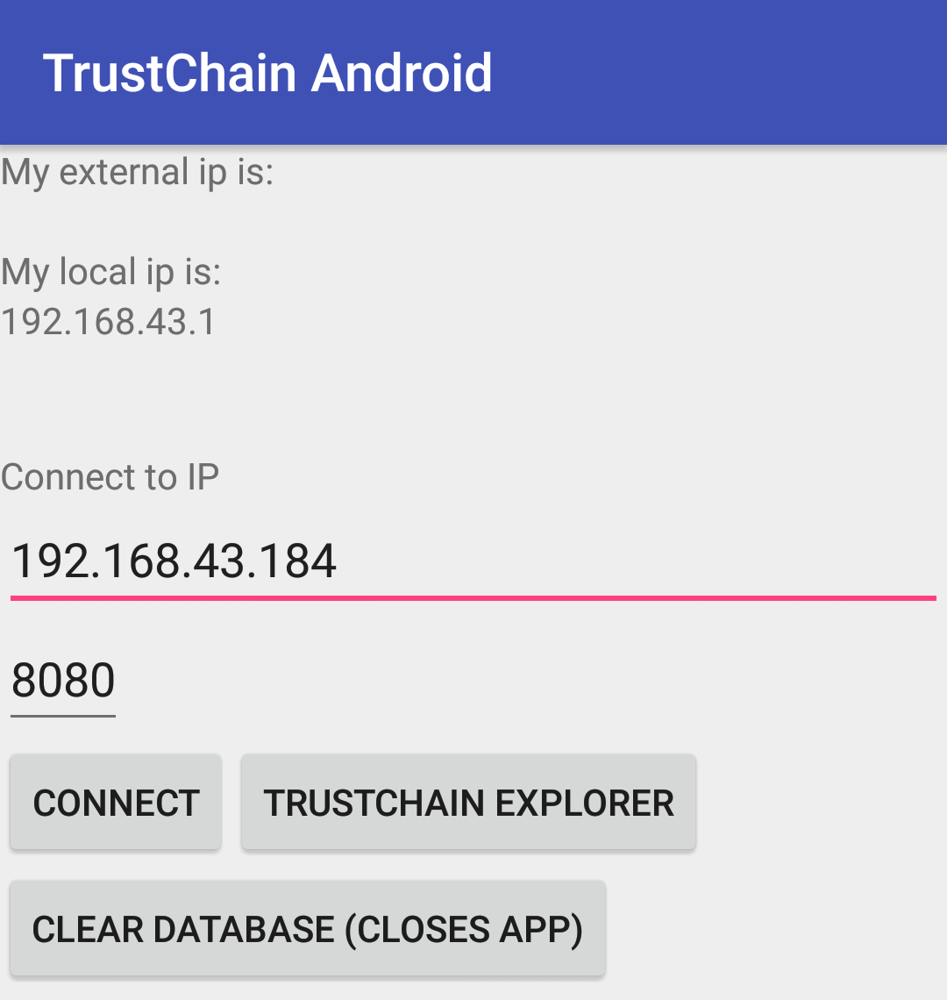
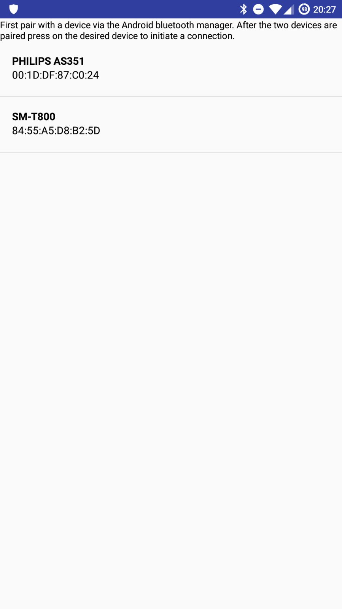

********************
Connection to a peer
********************

In order to send blocks to other people, you will need to find peers. In this simple app, this has to be done manually. In IPv8, this is done with help of `Dispersy <https://dispersy.readthedocs.io/en/devel/system_overview.html#overlay>`_.

There are two ways to connect to a peer: either via local network or bluetooth (note that bluetooth is not working perfectly). Therefore
connecting to a peer is very simple. Find out the IP-address of a peer who has opened the app, listed at the top in the main screen. Fill in the ip address and the port number (default hardcoded as 8080) and press connect. Now the app will go through the steps as explained in :ref:`creating-block-label`.

Sending a transaction to another peer via bluetooth requires you to pair the devices via the Android bluetooth manager. After they are paired, the app will list the devices your device is paired with. To initiate a transaction, press on one of the devices.

Connection
============
The class `Communication` is responsible for handling the data that is received either to bluetooth or WiFi. This class is abstract so that both type of connections use the same logic when a message is received. The classes `BluetoothConnection` and `NetworkConnection`  both have as parent `Communication`. The most imporant function of these two classes is `sendMessage`, which sends a message to a peer. A WiFi connection will create a new `ClientTask` and a bluetooth connection will create a `ConnectThread`, which will both send the message to the peer.

Wifi
============
The connection is made by using the `ServerSocket class <https://developer.android.com/reference/java/net/ServerSocket.html>`_. The implementation in TrustChain Android is done by a client-server style model. Although, since every device is a server can't really be seen as an exact client-server model. All outgoing messages, like sending a crawl request or half block, is done via client tasks. The server handles the incoming messages. It checks whether it has received a half block or a crawl request and calls handles the response by calling either ``synchronizedReceivedHalfBlock`` or ``receivedCrawlRequest``.

If, from looking at the source code, it is not yet clear how the connection is made, please look into other `Android server/client tutorials <http://android-er.blogspot.nl/2014/02/android-sercerclient-example-server.html>`_ that can be found online.

The simplest way for connecting via IP, which does not have to deal with possible NAT puncturing or port forwarding is connecting to a local IP on the same WiFi network. A guaranteed method involves setting up a WiFi hotspot on one of the devices and letting the other peer connect to this hotspot. WiFi networks, which make use of IPv6 are not guaranteed to work.

Example of connecting to a peer using on a device using a WiFi hotspot.

Bluetooth
==================================
Bluetooth works similar to WiFi: a server is created which is listening for messages, and a client send messages to server. However, with WiFi the messages are sent through two different ports and thus two different connections. This is not possible with Bluetoooth so the client will reuse the socket.

Links to code
=============
* `ClientTask implementation (ClientTask.java) <https://github.com/wkmeijer/CS4160-trustchain-android/blob/master/app/src/main/java/nl/tudelft/cs4160/trustchain_android/connection/network/ClientTask.java>`_
* `Server implementation (Server.java) <https://github.com/wkmeijer/CS4160-trustchain-android/blob/master/app/src/main/java/nl/tudelft/cs4160/trustchain_android/connection/network/Server.java>`_
* `ConnectThread implementation (ConnectThread.java) <https://github.com/wkmeijer/CS4160-trustchain-android/blob/master/app/src/main/java/nl/tudelft/cs4160/trustchain_android/connection/bluetooth/ConnectThread.java>`_
* `AcceptThread implementation (AcceptThread.java) <https://github.com/wkmeijer/CS4160-trustchain-android/blob/master/app/src/main/java/nl/tudelft/cs4160/trustchain_android/connection/bluetooth/AcceptThread.java>`_

