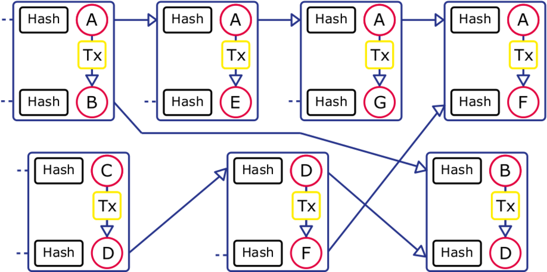

*******************
What is TrustChain?
*******************
In this section a short explanation of TrustChain is given. For a more extensive and complete overview please refer to the documentation that can be found on the blockchain lab `website <http://www.blockchain-lab.org/#blockchain>`_.

TrustChain is designed to deliver scalable distributed trust. This is achieved by letting two parties agree to a deal or transaction and storing the proof of the transaction in an immutable way. The transaction is stored in a block and a series of blocks are chained together to form a blockchain. To achieve scalability, each peer keeps track of their own blockchain which holds all the transactions they participated in. So when two peers want to agree on a transaction peer A creates a block with the transaction, signs it, adds it to their chain and sends it to peer B. Then peer B creates a block based on the block it received from A, signs it, adds it to their chain and sends it back to peer A. Both parties now have a proof of their transaction in their chain and they also have a copy of the block from the other party. For a more detailed description of how a block is created see :ref:`creating-block-label`.

Many transactions by many peers thus create a complicated network of entangled chains. However, the size of the chain of one peer is entirely dependent on the amount of transactions they participate in, so the whole system scales very well. The following picture tries to make the entanglement more clear. Each unique letter in the image represents a unique peer.

Dispersy
========
For peer discovery and handling the crawl requests for obtaining knowledge about peers, Dispersy is used in the `ipv8 implementation <https://github.com/qstokkink/py-ipv8>`_ of TrustChain. Dispersy is not implemented in this Android project and discussing it is out of scope for this documentation. For more information read the `Dispersy readthedocs page <https://dispersy.readthedocs.io/en/devel/index.html>`_.

